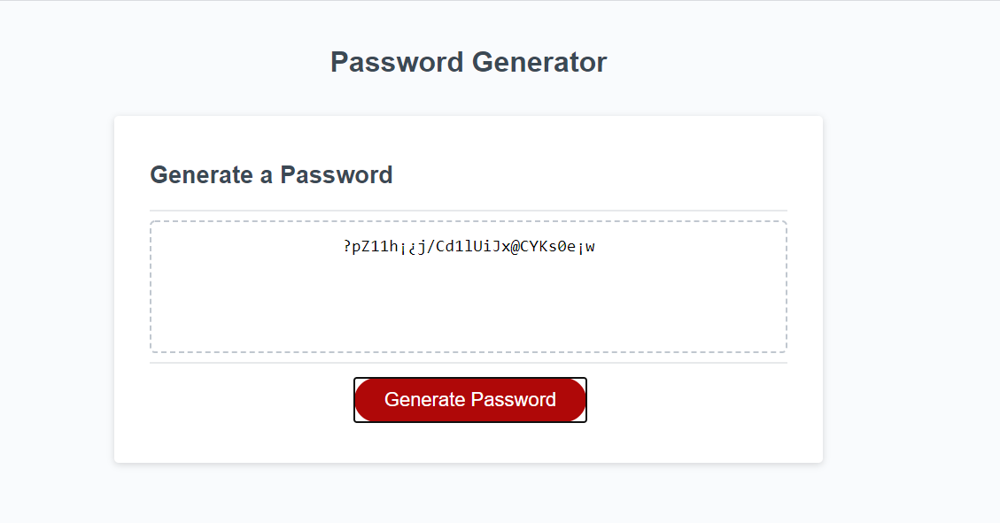

# H3-Password-Generator

## Random Password Generator
This little app consists in creating a random password based on the specifics that are asked to the user.

## Screenshot

### Generate Password Button
You must click in this button to start the app.

### Questions
#### Question 1
The app will ask you to choose certain number or characters that will make up your password.

#### Question 2
The app will ask you if you want to include lowercase letters in your random password.

#### Question 3
The app will ask you if you want to include uppercase letters in your random password.

#### Question 4
The app will ask you if you want to include numbers in your random password.

#### Question 5
The app will ask you if you want to include special characters in your random password.

### Please be advised the following
If you do not follow the instructions from the first question, the app will throw you a not valid alert.
If you do not enter any confirmation after the first question, the app will throw you a not valid alert.